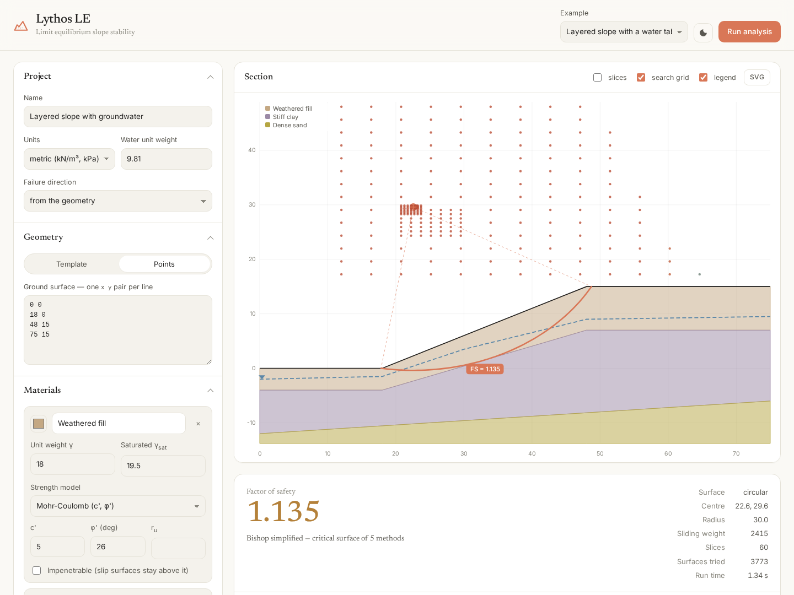

# Lythos LE

[](https://pypi.org/project/lythosle/)
[](https://pypi.org/project/lythosle/)
[](LICENSE)

Limit equilibrium slope stability analysis in pure Python, with a browser front end.

Lythos LE computes the factor of safety of slopes and embankments with the method
of slices, the same class of analysis as Rocscience Slide or GeoStudio SLOPE/W.
It searches for the critical slip surface, reports every classical method on it,
and draws the section in the browser.

* **No dependencies.** The solver, the web server and the front end are standard
  library and vanilla JavaScript. `python -m lythosle serve` works on a bare
  Python 3.9+ install with nothing to pip install.
* **Eight methods**, from Fellenius to Morgenstern-Price, all built on one slice
  formulation so the differences between them are the assumptions, not the code.
* **Validated** against closed-form solutions, Taylor's stability numbers and the
  ACADS benchmark problem (see [Validation](#validation)).



---

## Quick start

```bash
pip install lythosle

lythosle serve --open         # browser interface on http://127.0.0.1:8000
lythosle example              # list the built-in examples
lythosle example homogeneous  # run one and print the report
```

Or straight from a clone, with nothing installed at all — the solver, the
server and the front end are standard library only:

```bash
git clone https://github.com/hdaltuntas/lythosle
cd lythosle

python main.py                         # same interface
python main.py example homogeneous     # same commands
python -m unittest discover -s tests   # run the test suite
```

`main.py` takes everything the CLI does and starts the web interface when
given nothing; `HOST` and `PORT` override the address, so a host that sets
`PORT` gets a server bound to every interface. The same commands are also
available as `python -m lythosle …`.

## What it does

| | |
|---|---|
| **Methods** | Ordinary (Fellenius), Bishop simplified, Janbu simplified and corrected, Corps of Engineers #1, Lowe-Karafiath, Spencer, Morgenstern-Price (half-sine, constant or trapezoidal interslice function) |
| **Surfaces** | Circular (grid-and-tangent search with adaptive box and refinement), a single specified circle, a user-defined non-circular surface, and non-circular optimisation from the critical circle |
| **Strength** | Effective stress (c', phi'), undrained (s<sub>u</sub>, optionally increasing linearly with depth), impenetrable and no-strength materials |
| **Groundwater** | Piezometric water table, per-material pore pressure ratio r<sub>u</sub>, separate saturated unit weights, ponded water on the slope |
| **Loading** | Surface surcharges, pseudo-static seismic coefficients k<sub>h</sub> and k<sub>v</sub>, reinforcement (nails, anchors, geosynthetics), tension cracks with optional water pressure |
| **Output** | Factor of safety per method, the critical surface, a full slice force table (CSV), the lambda-FS plot for Spencer/Morgenstern-Price, the search grid, JSON for everything |

## The three ways in

### Browser

```bash
python -m lythosle serve --port 8000 --open
```

Build the geometry from a template or by typing coordinates, set up materials,
groundwater and loading in the sidebar, then **Run analysis** (or Ctrl/Cmd +
Enter). The section view shows the layers, the phreatic surface, the critical
surface with its centre of rotation, the search grid coloured by factor of
safety, the slices and the reinforcement. Results can be exported as SVG, CSV
and JSON. The interface follows the system light/dark setting; the toggle in
the header pins it.

`?example=layered_water` and `?theme=dark` work as URL parameters.

The interface follows Claude's design language: the ivory and charcoal
surfaces, the clay accent, sentence-case labels and a serif for the wordmark,
headings and prose. Claude's own faces (Styrene, Tiempos, Copernicus) are
licensed, so the stack asks for them first and falls back to Inter and
Newsreader, which are bundled in `lythosle/web/static/fonts/` — nothing is
fetched from a CDN at runtime, and the page looks the same offline.

If you prefer FastAPI, `uvicorn lythosle.web.app:app` serves exactly the same
API (`pip install fastapi uvicorn` first).

### Command line

```bash
lythosle analyze model.json --method bishop --method spencer \
         --slices 60 --json result.json --csv slices.csv
lythosle example seismic --optimize
lythosle methods
```

`analyze` takes either a bare model file or a `{"model": ..., "options": ...}`
file — which is exactly what the browser's **Download** button produces.

### Python

```python
from lythosle import SlopeModel, AnalysisOptions, analyze

model = SlopeModel.from_dict({
    "profile": [[0, 0], [10, 0], [30, 10], [50, 10]],
    "materials": [{"name": "fill", "unit_weight": 20, "cohesion": 3,
                   "friction_angle": 19.6}],
    "layers": [{"material": "fill"}],
})

result = analyze(model, AnalysisOptions.from_dict({
    "methods": ["bishop", "spencer"],
    "n_slices": 60,
    "search": {"nx": 16, "ny": 16, "n_tangent": 16, "refine_passes": 4},
}))

print(result.critical_fs)              # 0.985
print(result.results["spencer"].lam)   # interslice force ratio
print(result.text_report())
```

Lower level pieces are available too:

```python
from lythosle import build_slices, circular_surface, solve_all

surface = circular_surface(model.canonical(), xc=20, yc=30, radius=28)
mass = build_slices(model.canonical(), surface, n_slices=50)
print({k: v.fs for k, v in solve_all(mass).items()})
```

## Model format

Coordinates are `[x, y]` with `y` as elevation, in whatever consistent unit set
you use (kN/m³ and kPa, or pcf and psf). The full reference is in
[docs/model-format.md](docs/model-format.md); the short version:

```json
{
  "name": "Layered slope",
  "units": "metric",
  "profile": [[0, 0], [18, 0], [48, 15], [75, 15]],
  "materials": [
    {"name": "Fill",  "unit_weight": 18, "sat_unit_weight": 19.5,
     "cohesion": 5, "friction_angle": 26, "color": "#C4A883"},
    {"name": "Clay",  "unit_weight": 19, "strength_model": "undrained",
     "su": 40, "su_gradient": 1.5, "su_datum": 0}
  ],
  "layers": [
    {"material": "Fill"},
    {"material": "Clay", "boundary": [[0, -4], [75, 7]]}
  ],
  "water_table": [[0, -2], [30, 3.5], [75, 9.5]],
  "seismic": {"kh": 0.15, "kv": 0},
  "surcharges": [{"x1": 50, "x2": 70, "pressure": 20}],
  "supports": [{"name": "Nail 1", "x1": 14, "y1": 1.5,
                "x2": 28, "y2": -0.2, "capacity": 40}],
  "tension_crack": {"enabled": true, "depth": 3, "water_fill": 1.0}
}
```

Layers are listed from the top down. The first one starts at the ground
surface; each one below it carries the boundary that forms its top. Boundaries
and the water table are extended horizontally beyond their end points.

The slope may be drawn facing either way: the solver mirrors the model
internally so the crest is on the right, and mirrors every result back. Set
`"direction": "left" | "right"` in the options to analyse a chosen face of a
two-sided embankment.

## Formulation

Every method is built on the same slice equations, so the only differences are
which equilibrium conditions are satisfied and what is assumed about the
interslice forces `X = lambda * f(x) * E`:

| Method | Moment | Force | Interslice shear |
|---|---|---|---|
| Ordinary / Fellenius | yes | no | ignored entirely |
| Bishop simplified | yes | no | `X = 0` |
| Janbu simplified / corrected | no | yes | `X = 0` (corrected applies Janbu's `f0`) |
| Corps of Engineers #1 | no | yes | parallel to the entry-exit chord |
| Lowe-Karafiath | no | yes | average of ground and base inclination |
| Spencer | yes | yes | constant inclination, solved for |
| Morgenstern-Price | yes | yes | `f(x)` shape, `lambda` solved for |

The base normal force comes from vertical equilibrium of each slice,

```
N = [ W (1 + kv) + (X_right - X_left) - (c l - u l tan phi) sin(alpha) / F ] / m_alpha
m_alpha = cos(alpha) + sin(alpha) tan(phi) / F
```

and the factor of safety from moment equilibrium about the centre of rotation
or from horizontal force equilibrium of the whole mass. Spencer and
Morgenstern-Price iterate on `lambda` until the two agree — the crossing point
you can see on the lambda-FS plot in the interface.

The sign conventions, the treatment of pore pressure, seismic loads,
reinforcement, tension cracks, and the search algorithms are documented in
[docs/theory.md](docs/theory.md). Read it before trusting a number.

## Validation

`tests/test_methods.py` checks the solver against results that do not come from
this code:

| Check | Reference | Result |
|---|---|---|
| Circular arc in phi = 0 soil | direct integration of `c L R / M` | within 0.002 of the closed form; identical across Ordinary, Bishop, Spencer and Morgenstern-Price, as theory requires |
| Long planar surface | infinite slope, `FS = tan(phi')/tan(beta)` | within 1% for Bishop, Janbu, Spencer and Morgenstern-Price |
| Toe circles, phi = 0, beta = 53-75 deg | Taylor (1937) stability numbers | within 1.5% |
| ACADS problem 1(a) | published FS = 1.00 | Bishop 0.985, Spencer 0.984 |
| Mirrored geometry | the same slope drawn facing the other way | identical FS and lambda |
| Slice refinement | 20 to 200 slices | converges monotonically, < 0.002 change past 100 slices |

Method relationships are asserted as well: Ordinary is the most conservative,
Bishop sits within 2% of Spencer for circular surfaces, and Morgenstern-Price
needs a larger `lambda` than Spencer because the half-sine function averages
less than one.

## Limitations

Worth knowing before you use a number in anger:

* Two-dimensional analysis only, per unit width out of plane.
* The slice weight uses the mid-ordinate of each slice, so strongly curved
  boundaries need more slices (the default 50 is enough for typical sections).
* Moment-only methods (Ordinary, Bishop) on a **non-circular** surface depend on
  the choice of moment axis. The result is reported with a warning; use Spencer
  or Morgenstern-Price for non-circular surfaces.
* Spencer and Morgenstern-Price have no solution when `Fm` and `Ff` never
  intersect, which happens when reinforcement is large enough to satisfy force
  equilibrium by itself. Lythos LE reports this as "no solution" with both
  values rather than inventing a number.
* Reinforcement is applied as a known force at the intersection with the slip
  surface. Pull-out capacity along the anchored length is not calculated for
  you — put the design force in.
* Negative effective normal forces are clipped to zero (the usual practice),
  and surfaces with a very small `m_alpha` are flagged as poorly conditioned.
* Probabilistic analysis, rapid drawdown, anisotropic strength and 3D effects
  are not implemented.

## Project layout

```
main.py          run the interface, or anything the CLI does
lythosle/
  geometry.py    polylines, intersections, polygon helpers
  materials.py   strength models
  model.py       geometry, stratigraphy, groundwater, loading, mirroring
  slices.py      slip surfaces and the slicing of the sliding mass
  methods.py     the eight limit equilibrium solvers
  search.py      grid-and-tangent search and non-circular optimisation
  analysis.py    the driver, reporting and drawing data
  examples.py    six worked examples
  cli.py         command line interface
  web/           API, standard library server, optional FastAPI app, front end
tests/           70 tests, ~60 s
docs/            theory, model format, exported example models
```

## Licence

MIT.
